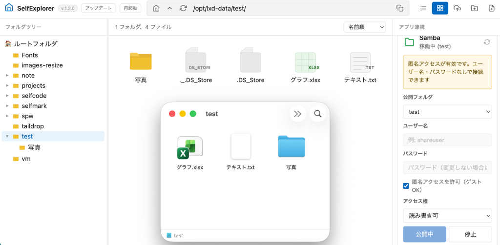

# SelfExplorer

セルフホストして使うファイラーです。 /opt/lxd-data 配下のファイルをブラウザから閲覧・編集できます。



## インストール方法

### クイックインストール（推奨）

```bash
sudo bash -c "$(curl -fsSL https://raw.githubusercontent.com/hirogura/selfexplorer/main/install-selfexplorer1.sh)"
```

### 手動インストール

```bash
# 1. リポジトリをクローン
git clone https://github.com/hirogura/selfexplorer.git /tmp/selfexplorer
sudo rsync -a /tmp/selfexplorer/ /opt/selfexplorer/
rm -rf /tmp/selfexplorer

# 2. 設定を編集 (必要に応じて)
# /opt/selfexplorer/server/server.js の PORT, ROOT_DIR を編集
# /opt/selfexplorer/public/js/app.js の ROOT_PREFIX を編集

# 3. npm 依存関係をインストール
cd /opt/selfexplorer/server
npm install --production

# 4. systemd サービスをセットアップ
sudo tee /etc/systemd/system/selfexplorer.service <<'EOF'
[Unit]
Description=SelfExplorer File Manager
After=network.target

[Service]
Type=simple
WorkingDirectory=/opt/selfexplorer/server
ExecStart=/usr/bin/node server.js
Restart=always
RestartSec=5
Environment=NODE_ENV=production

[Install]
WantedBy=multi-user.target
EOF

sudo systemctl daemon-reload
sudo systemctl enable selfexplorer
sudo systemctl start selfexplorer
```

### インストールスクリプトを使用する場合

`install-selfexplorer1.sh` をダウンロードして実行するか、上記のクイックインストールコマンドを実行してください。

## OnlyOffice フォント追加（オプション）

OnlyOffice で日本語などのフォントを正しく表示するには、`/opt/lxd-data/Fonts/` にフォントファイル（ttf / otf / woff / woff2）を配置してから、以下のスクリプトを実行します。

```bash
sudo bash -c "$(curl -fsSL https://raw.githubusercontent.com/hirogura/selfexplorer/main/add-fonts.sh)"
```

このスクリプトは以下の処理を行います:

1. `/opt/lxd-data/Fonts/` を OnlyOffice コンテナの `/usr/share/fonts/custom` に read-only マウントで追加（`docker-compose.yml` を自動更新）
2. 変更前の `docker-compose.yml` をタイムスタンプ付きでバックアップ
3. コンテナを再作成（データは保持）
4. コンテナ内でフォントキャッシュを再生成（`fc-cache` / AllFonts.js / テーマ再生成）

注意:

- 実行前に `/opt/lxd-data/Fonts/` にフォントファイルを配置しておいてください（ファイルが 1 件も無い場合は中断します）
- 再実行しても安全です（マウントが既にあればキャッシュ再生成のみ行います）
- 完了後はブラウザキャッシュをクリアしてから OnlyOffice でフォントを確認してください

## 要件

- Node.js 18 以上
- git
- systemd (推奨)
- OnlyOffice 連携には Docker

## アクセス

SelfExplorer は `127.0.0.1` にのみバインドされているため、**Tailnet（Tailscale）内からしかアクセスできません**。LAN やインターネットからの直接アクセスはできません。

- サーバー上: http://localhost:3346
- Tailnet 内: https://`<hostname>.ts.net:3346` (Tailscale Serve が有効な場合)
- OnlyOffice: https://`<hostname>.ts.net:3322` (こちらも Tailnet 内のみ)

### ネットワーク構成

| サービス | バインド | 公開範囲 |
|---|---|---|
| SelfExplorer (3346) | `127.0.0.1` | Tailnet 内のみ |
| OnlyOffice (3322) | `127.0.0.1` | Tailnet 内のみ |


### アンインストール方法

以下の手順でアンインストールできます。

```bash
# 1. サービスを停止・無効化
sudo systemctl stop selfexplorer
sudo systemctl disable selfexplorer

# 2. systemd サービスファイルを削除
sudo rm /etc/systemd/system/selfexplorer.service
sudo systemctl daemon-reload

# 3. インストールディレクトリを削除
sudo rm -rf /opt/selfexplorer

# 4. Tailscale Serve の設定を解除
tailscale serve --https=3346 off
```

注意点:

/opt/lxd-data（ブラウズ対象のデータ）は削除されません — SelfExplorer はこのフォルダの中身を表示していただけなので、実データはそのまま残ります。他のサービス（EasyNote改めSelfNote等）も同じ /opt/lxd-data を共有している場合は特に、このディレクトリは消さないでください。
OnlyOffice(/opt/onlyoffice)は、インストール時に「既存環境を再利用」を選んだ場合は他のサービス(nextExplorer等)とも共有されている可能性があります。SelfExplorer専用に新規インストールしていて、かつ他で使っていないなら削除可能です

```bash
cd /opt/onlyoffice && sudo docker compose down
sudo rm -rf /opt/onlyoffice
```

ただし共有している場合は残しておいてください。

ポート 3346(SelfExplorer本体)・3322(OnlyOffice)を他で使っていないか確認してから解放するのが安全です。
